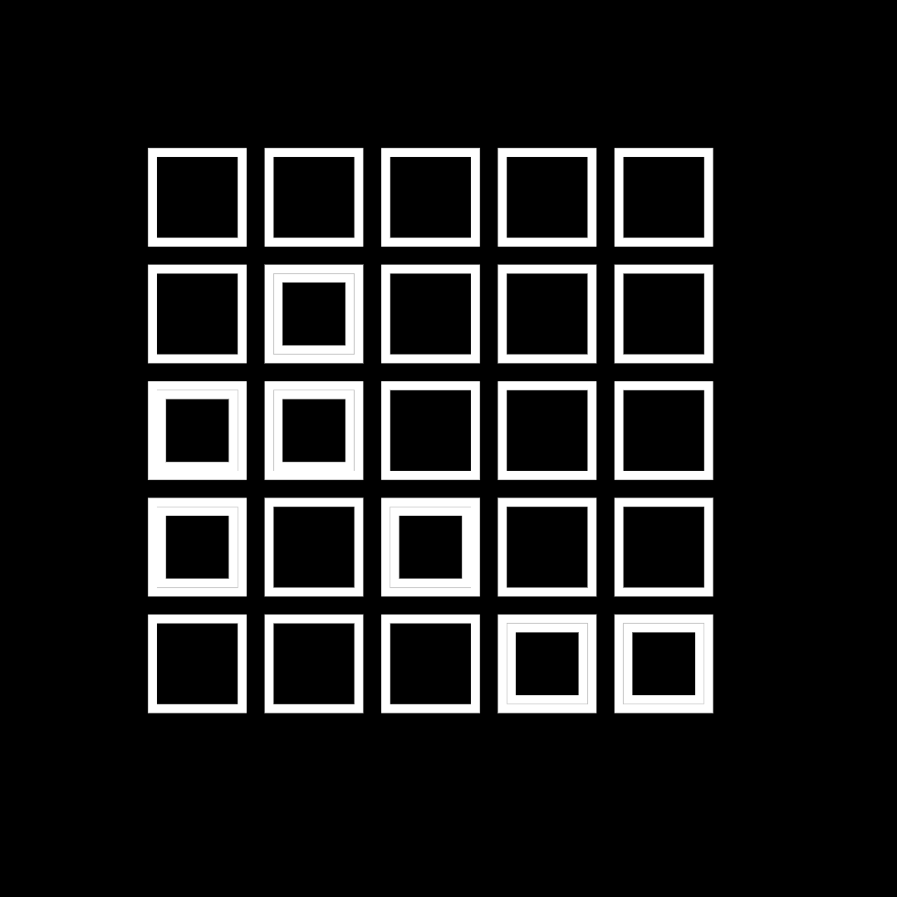

# Sketches

This repository contains a collection of creative sketches implemented in JavaScript (and some Python assets). The outputs for each concept are stored in the `output/` directory. You can browse the generated images and videos via the links below:

## Outputs

### 01 – early experiments (Random grids)

> Full folder: [output/01](output/01)

### 02 – Wheel

> Full folder: [output/02](output/02)

### 03 – Floating dots

<video controls width="320" src="output/03/2022.02.16-18.16.19.mp4">
Your browser does not support the <code>video</code> element.
</video>

> Full folder: [output/03](output/03)

### 04 – Noisy grid

> Full folder: [output/04](output/04)

### 05 – Calligraphy E

> Full folder: [output/05](output/05)

## Structure

- `arcs.js` &ndash; sketch using arcs
- `box_grid.js` &ndash; grid of boxes
- `Face.js` &ndash; face rendering code
- `glyphText.js` &ndash; glyph-based text
- `noise_grid.js` &ndash; noise-driven grid
- `web.js` &ndash; main web launcher
- `assets/` &ndash; supporting assets (Python script, etc.)

## Usage

Open `web.js` in a browser or run `npm install` followed by `npm start` to view and interact with the sketches.

